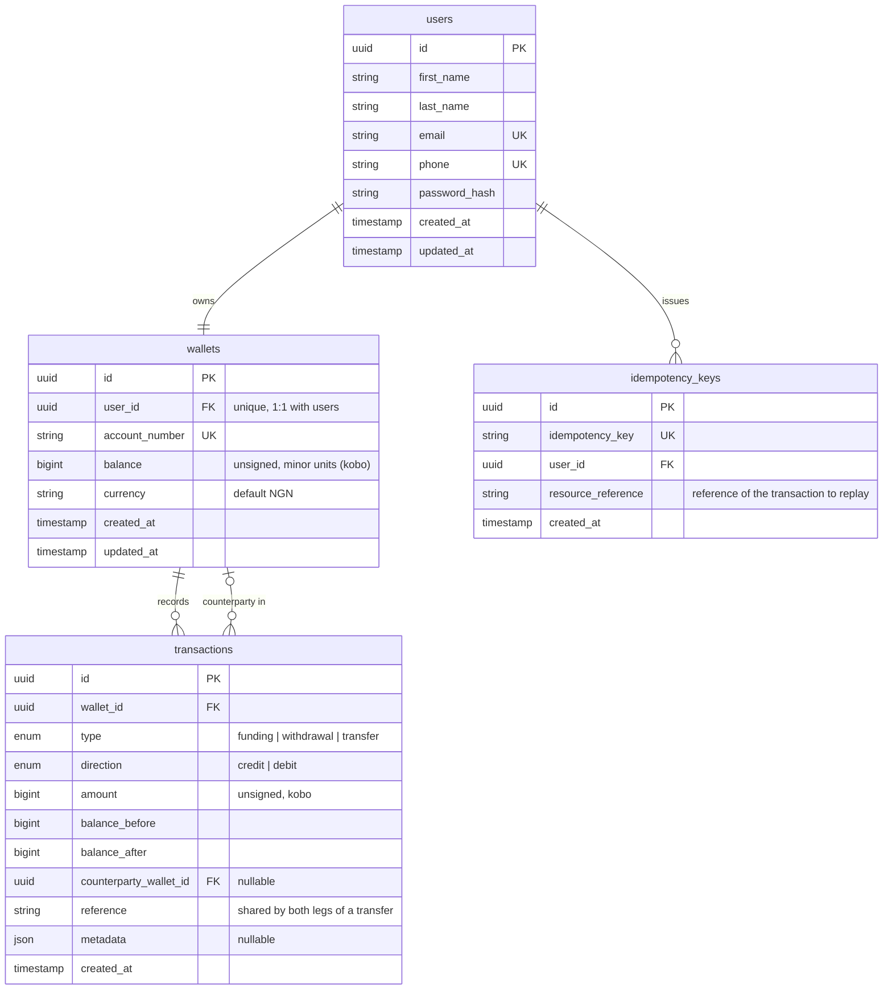

# Demo Credit Wallet Service

An MVP wallet service for **Demo Credit**, a mobile lending app. Borrowers use a
wallet to receive loan disbursements and to make repayments. The service lets a
user create an account, fund it, transfer to another user, and withdraw, while
making sure anyone on the **Lendsqr Adjutor Karma** blacklist is never onboarded.

## Live

|                    |                                                                |
| ------------------ | -------------------------------------------------------------- |
| Base URL           | `https://emmanuel-adams-lendsqr-be-test.onrender.com/api/v1`   |
| API docs (Swagger) | `https://emmanuel-adams-lendsqr-be-test.onrender.com/api-docs` |
| Health check       | `GET /api/v1/health`                                           |

The Swagger page is generated from the same Zod schemas the API validates with,
so the documented request and response shapes cannot drift from the code.

## What it does

- Create an account (a user and their wallet are provisioned together)
- Fund a wallet
- Transfer funds to another user's wallet
- Withdraw funds
- Reject onboarding for anyone found on the Adjutor Karma blacklist

Authentication is a faux bearer token, `register` and
`login` return a signed JWT, protected routes expect it in the
`Authorization: Bearer <token>` header.

## Tech stack

| Concern       | Choice                |
| ------------- | --------------------- |
| Runtime       | Node.js (LTS 22)      |
| Language      | TypeScript (strict)   |
| Web framework | Express               |
| Query builder | Knex.js               |
| Database      | MySQL 8               |
| Validation    | Zod                   |
| Auth          | Faux JWT bearer token |
| Password hash | argon2                |
| Logging       | Pino                  |
| Testing       | Jest + Supertest      |

## Architecture

The code is organised by domain, and each domain is split by layer. A request
travels **Route -> Controller -> Service -> Repository -> Knex**, and each layer
has one job: the route wires middleware, the controller handles HTTP and
validation, the service owns business rules and transaction scoping, and the
repository is the only place that talks to the database.

```
src/
  config/                 # validated configuration
    env.ts                #   environment schema and parsed env
    database.config.ts    #   knex connection settings per environment
  common/                 # cross-cutting modules, each shared by many callers
    api/response/         #   SuccessResponse / ErrorResponse envelopes
    auth/                 #   token signing and verification
    errors/               #   AppError hierarchy and database error helpers
    idempotency/          #   idempotency-key repository
    middleware/           #   auth, rate limiting, error handling, timing
    utils/                #   logger, async handler, phone formatting
  database/               # standalone: schema migrations
    migrations/
  loaders/                # startup wiring
    database.loader.ts    #   creates the knex connection and confirms it
    knexfile.docker.ts    #   knex CLI config for container migrations
  domain/
    wallet/               # one domain, shown expanded; the others follow the same layout
      route/              #   route wiring and middleware
      controller/         #   HTTP: parse, validate, respond
      service/            #   business rules and transaction scoping
      repository/         #   Knex data access
      dto/                #   Zod request schemas
      types/              #   row, insert, and response types (the data model in code)
    auth/                 # login
    user/                 # registration and onboarding
    transaction/          # ledger entries
    health/               # liveness probe
  integrations/
    adjutor/              # Karma blacklist client
  docs/                   # OpenAPI registry, per-domain path definitions
  routes/                 # root API router
  app.ts                  # Express app assembly
  server.ts               # bootstrap and graceful shutdown
```

Controllers and services are classes with their dependencies injected through
the constructor (defaulting to a real instance). That keeps the wiring simple in
production and lets the unit tests pass in mocks without a running database. The
connection itself is owned by the database loader, which creates it and confirms
it is reachable before the server accepts traffic.

There is no ORM model layer: Knex is a query builder, not an ORM, so the schema
is defined by the migrations under `database/migrations`, the row, insert, and
response shapes live as typed interfaces in each domain's `types/`, and every
query is confined to the repositories.

## Database schema (E-R diagram)

Four tables. The constraints do most of the enforcing: the unique `user_id` on
`wallets` makes "one wallet per user" a rule the database keeps rather than a
convention the code hopes for, the append-only `transactions` table preserves
history instead of overwriting it, and the unique `idempotency_key` turns
exactly-once money movement into a guarantee. Money never leaves the database as
a floating-point number.



- A wallet belongs to exactly one user (`wallets.user_id` is unique), so the
  account and its wallet are created and destroyed as a unit.
- A transfer writes **two** ledger rows, a debit on the sender and a credit on
  the recipient, that share one `reference`. The `counterparty_wallet_id` links
  the two sides so a statement can show who the money went to or came from.
- `idempotency_keys` records the client-supplied key against the reference of
  the transaction it produced, so a retried request replays the original result
  instead of moving money twice.

## API reference

All paths are prefixed with `/api/v1`.

| Method | Path                   | Auth | Description                                |
| ------ | ---------------------- | ---- | ------------------------------------------ |
| GET    | `/health`              | no   | Liveness probe                             |
| POST   | `/auth/register`       | no   | Create a user and wallet, return a token   |
| POST   | `/auth/login`          | no   | Authenticate, return a token               |
| GET    | `/wallet`              | yes  | Current balance                            |
| POST   | `/wallet/fund`         | yes  | Fund the wallet                            |
| POST   | `/wallet/transfer`     | yes  | Transfer to another account number         |
| POST   | `/wallet/withdraw`     | yes  | Withdraw from the wallet                   |
| GET    | `/wallet/transactions` | yes  | Paginated ledger, filter by type/direction |

**Amounts are integers in kobo** (minor units). `50000` is 500.00 NGN.

The three money-moving endpoints accept an optional `Idempotency-Key` header.
Send the same key on a retry and the original outcome is returned without
re-applying the operation.

Every response uses the same envelope:

```jsonc
// POST /api/v1/wallet/fund   { "amount": 50000 }
{
  "success": true,
  "message": "Wallet funded successfully",
  "data": {
    "wallet": {
      "id": "d1f8...",
      "accountNumber": "1234567890",
      "balance": 50000,
      "currency": "NGN",
    },
    "transaction": {
      "id": "9ac3...",
      "type": "funding",
      "direction": "credit",
      "amount": 50000,
      "balanceAfter": 50000,
    },
  },
}
```

Errors carry the same shape with `success: false`, a message, and, for
validation failures, a field-level `errors` array. A dev-only `processingTime`
field is appended outside production.

## Trying it out

The service is self-serve, so the production database is never seeded with
fixtures or shared credentials. A reviewer creates their own data:

1. `POST /auth/register` twice, for two different users, and keep both tokens.
2. `POST /wallet/fund` on the first account.
3. `POST /wallet/transfer` from the first account to the second account's number.
4. `POST /wallet/withdraw`, then `GET /wallet/transactions` to read the ledger.

Registering with a blacklisted phone number is refused at step 1, which is the
Karma check doing its job.

## Design decisions

**Money as integer minor units.** Balances and amounts are `BIGINT UNSIGNED`
kobo. Floating-point money drifts under arithmetic, so nothing in the system
ever holds a decimal; formatting to naira is a presentation concern for clients.

**Transaction scoping and concurrency.** Every balance change runs inside a Knex
transaction. The affected wallet rows are read with `SELECT ... FOR UPDATE`, so a
second concurrent request on the same wallet blocks until the first commits.
This is what prevents two simultaneous withdrawals from both passing the balance
check and overdrawing the account. A transfer locks both wallets in a fixed
id order to avoid deadlocks between crossing transfers.

**Double-entry ledger.** The `transactions` table is append-only. Each row
records `balance_before` and `balance_after`, so a wallet's history is fully
reconstructable and a discrepancy is easy to spot. The balance column on
`wallets` is a cached total that the ledger can always verify.

**Idempotency.** Money-moving requests can be retried safely with an
`Idempotency-Key`. The key is inserted inside the same transaction that moves the
money, under a unique constraint, so even two requests racing with the same key
resolve to a single applied operation and one replayed result.

**Karma blacklist.** Onboarding calls the Adjutor Karma API with the user's
phone number (normalised to international `+234` format) before any record is
written. A hit blocks registration with `403`. The check fails closed: if
Adjutor is unreachable, onboarding is refused rather than risk admitting a
blacklisted user. Phone is used as the single identifier for the MVP; BVN would
be the stronger production identifier but carries encryption-at-rest and
in-transit obligations that sit outside this scope.

**Faux authentication.** A signed JWT stands in for a full auth system, as the
brief allows. Passwords are hashed with argon2. The token carries the user id;
protected routes resolve it in middleware and never trust a client-supplied id.

**Validation and safety.** Every request body and query is parsed by a Zod
schema at the controller boundary, so invalid input is rejected with `422`
before it reaches business logic. Helmet sets security headers, CORS is enabled,
the JSON body is capped at 10kb, and rate limiters guard the API generally and
the financial endpoints specifically.

## Testing

Positive and negative paths are covered without a running database:

- **Service unit tests** mock the repositories and exercise the money logic
  directly: successful fund/transfer/withdraw, insufficient funds, missing
  wallets, self-transfer, pagination and filtering, that locks are taken, that a
  missing idempotency key is a no-op, and that a repeated key (and a racing
  duplicate-key insert) replays instead of re-applying.
- **Route integration tests** drive real HTTP through the middleware stack with
  Supertest: `401` without a token, `422` on invalid bodies, and the success
  paths for register, login, balance, and fund.
- **Adjutor client tests** cover clean, blacklisted, and failure responses.

```bash
npm test          # run the suite
npm run test:cov  # with coverage
```

## Security and reliability

The full **Security & API Review** and **Failure Handling & Debugging** report
is part of the submission document. In short: endpoints are authenticated and
rate-limited, all input is schema-validated, errors flow through a single
handler that returns a safe envelope and hides stack traces in production, and
structured Pino logs with a per-request id make failures traceable.

## Getting started

```bash
# 1. Install dependencies
npm install

# 2. Configure environment
cp .env.example .env   # then fill in DB and Adjutor credentials

# 3. Run migrations
npm run migrate:latest

# 4. Start in watch mode
npm run dev
```

The service reads its configuration from environment variables validated at
startup; see `.env.example` for the full list. A managed MySQL host that
requires TLS (for example Aiven) is supported through `DB_SSL` and an optional
pinned CA in `DB_CA_CERT`.

## Run with Docker

The whole stack (API plus MySQL) runs with one command; migrations are applied on
startup:

```bash
docker compose up --build
```

The API is then on `http://localhost:3000`. The image is a multi-stage build that
compiles TypeScript in a full-dependency stage and ships only the compiled output
and production dependencies in a slim runtime, running as a non-root user with a
health check. Onboarding calls the live Adjutor API, so export a real
`ADJUTOR_API_KEY` (compose reads it from your `.env`) if you want the Karma check
to run; the rest of the service works without it.

## Scripts

| Script                   | Purpose                       |
| ------------------------ | ----------------------------- |
| `npm run dev`            | Start with hot reload         |
| `npm run build`          | Compile TypeScript to `dist/` |
| `npm start`              | Run the compiled build        |
| `npm run typecheck`      | Type-check without emitting   |
| `npm run lint`           | ESLint                        |
| `npm test`               | Run the Jest suite            |
| `npm run test:cov`       | Tests with coverage           |
| `npm run migrate:latest` | Apply database migrations     |

## Quality gates

A Husky pre-commit hook runs `lint-staged` (ESLint and Prettier on staged
files), then `npm run build`, then `npm test`. The commit is rejected unless all
three pass, so the repository never holds a broken or unformatted state.
